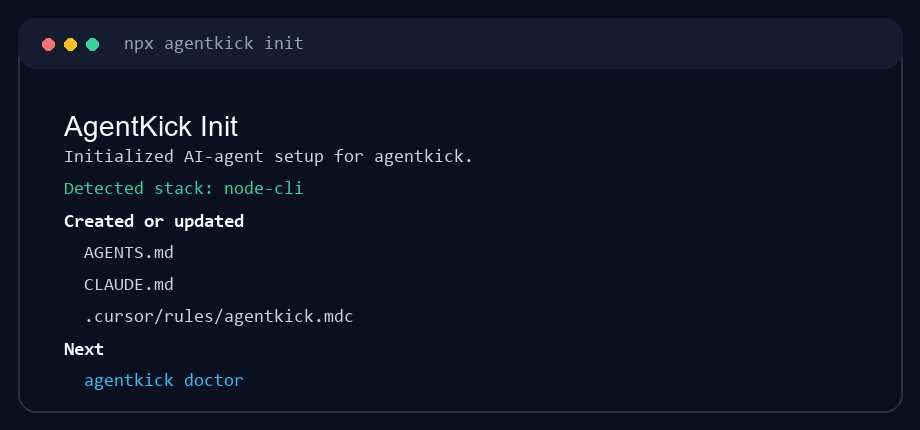
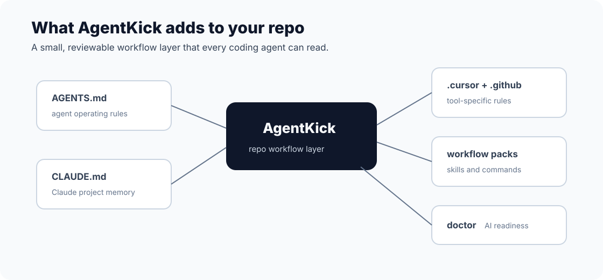
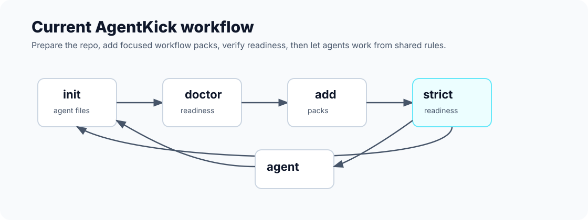
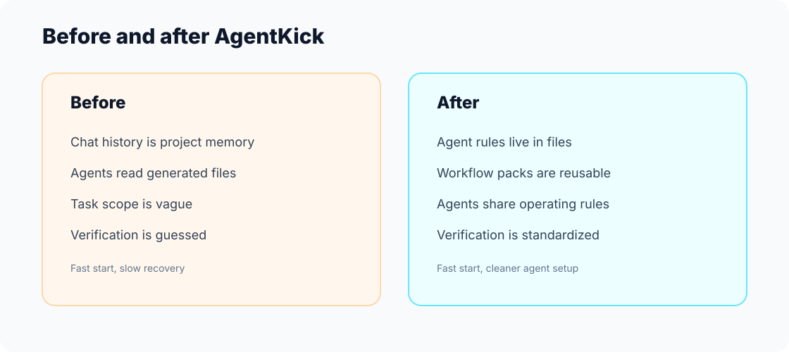
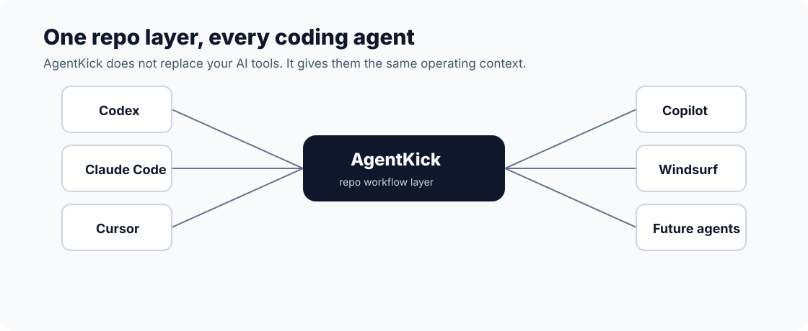

# AgentKick

The missing workflow layer for AI-assisted development.

AgentKick makes your repo easier for Codex, Claude Code, Cursor, GitHub Copilot, Windsurf, and future coding agents to understand, follow, and verify.

It is not another coding agent. It is a local-first repo layer for agent instructions, reusable workflows, safety rules, and AI workflow readiness.



```bash
npm install -g https://github.com/novatsingh/agentkick/archive/refs/heads/main.tar.gz
agentkick init
agentkick doctor
agentkick focus
agentkick summarize
```

> npm package publishing is not live yet. Until the first npm release, install from the GitHub tarball instead of `npx agentkick`.

Requires Node.js 16 or newer.

## Why AgentKick Exists

AI coding starts fast, then breaks down when the repo has no durable operating memory.

Common failure modes:

- every agent needs the same project explanation again
- giant chats become the only source of task memory
- generated files and old artifacts waste context
- agents edit outside the intended scope
- verification steps are guessed or skipped
- handoffs vanish after a thread reset

AgentKick fixes the workflow layer around the repo so your existing agents can work with less confusion.

## What AgentKick Adds



AgentKick creates a small, reviewable repo operating layer:

- `AGENTS.md` for coding-agent operating rules
- `CLAUDE.md` for Claude Code project memory
- `.cursor/rules/*` for Cursor
- `.github/copilot-instructions.md` for GitHub Copilot
- `.codex/agents/*` and `.claude/*` for reusable specialist workflows
- `.agentkick.json` for project metadata
- `agentkick doctor` for AI workflow readiness checks

Everything is plain text. Everything is reviewable in Git.

## Current CLI Workflow



### `agentkick init`

Prepares an existing repo for AI-assisted development.

```bash
agentkick init
```

Creates agent files, project metadata, and reusable workflow rules. It should not touch application source files.

### `agentkick add`

Adds stack-specific workflow packs to an existing repo.

```bash
agentkick add security
agentkick add github
agentkick add chrome-extension
agentkick add netlify
```

Packs add focused instructions, commands, skills, and review workflows without turning AgentKick into a runtime.

### `agentkick doctor`

Finds workflow risks that make coding agents slower or less reliable.

```bash
agentkick doctor
agentkick doctor --strict
agentkick doctor --json
```

Example output:

```text
AgentKick doctor

AI-readiness score: 100/100
Status: ready

PASS master repo intelligence: AGENTS.md
PASS Claude memory: CLAUDE.md
PASS Copilot root instructions: .github/copilot-instructions.md
PASS Claude security skill: .claude/skills/security-scan/SKILL.md
PASS Codex reviewer agent: .codex/agents/reviewer.md
PASS Cursor rules: .cursor/rules/agentkick.mdc
PASS AgentKick config: .agentkick.json
```

### `agentkick new`

Creates an agent-ready starter project.

```bash
agentkick new chrome-extension browser-helper
agentkick new nextjs my-saas
agentkick new fastapi my-api
```

The upcoming v1 workflow layer adds focused task context, summaries, and task splitting. See [Final MVP](docs/final-mvp/FINAL_MVP.md).

## Before And After



Before AgentKick:

- repo knowledge lives in chat history
- agents load too much context
- task scope is vague
- verification is inconsistent

After AgentKick:

- agent rules live in files
- workflow packs are reusable
- agents share the same operating rules
- verification is easier to standardize

## Works With Your Agent



AgentKick is designed for:

- Codex
- Claude Code
- Cursor
- GitHub Copilot
- Windsurf
- MCP-based workflows
- future autonomous coding agents

AgentKick does not replace those tools. It gives them a better repo operating layer.

## What AgentKick Is Not

AgentKick is not:

- semantic search
- vector retrieval
- embeddings infrastructure
- GraphRAG
- a code indexing competitor
- a hosted coding agent
- a cloud runtime

AgentKick focuses on workflow structure, repo memory, and operating rules for AI-assisted development.

## Generated Files

Current generated repo layer:

```text
AGENTS.md
CLAUDE.md
.agentkick.json
.cursor/rules/*
.github/copilot-instructions.md
.github/instructions/*
.codex/agents/*
.claude/commands/*
.claude/skills/*
.claude/agents/*
.agents/skills/*
```

The upcoming v1 workflow layer adds `.agentkick/memory/*` and `.agentkick/context/manifest.json`. See [Final MVP](docs/final-mvp/FINAL_MVP.md).

## Templates

AgentKick can also create agent-ready starter projects:

```bash
agentkick new chrome-extension browser-helper
agentkick new nextjs my-saas
agentkick new fastapi my-api
agentkick new go-cli my-tool
agentkick new landing-page launch-site
agentkick new node-cli my-tool
```

Supported templates:

- `chrome-extension`
- `nextjs`
- `landing-page`
- `node-cli`
- `fastapi`
- `flask`
- `laravel`
- `go-cli`
- `rust-cli`
- `electron`

## Packs

Packs add stack-specific workflow guidance to existing repos:

```bash
agentkick add security
agentkick add github
agentkick add chrome-extension
agentkick add netlify
```

Supported packs:

- `core`
- `chrome-extension`
- `nextjs`
- `netlify`
- `security`
- `github`
- `python`
- `php`
- `go`
- `rust`
- `electron`

See [docs/templates.md](docs/templates.md) and [docs/packs.md](docs/packs.md).

## Documentation

The architecture specs live under [`docs/`](docs/README.md).

- [System architecture](docs/architecture/SYSTEM_ARCHITECTURE.md)
- [Persistent memory](docs/memory/MEMORY_SYSTEM.md)
- [Doctor engine](docs/doctor/DOCTOR_ENGINE.md)
- [Context engine](docs/context-engine/CONTEXT_ENGINE.md)
- [Final MVP](docs/final-mvp/FINAL_MVP.md)

## Roadmap Snapshot

The next v1 implementation pass is locked around:

- `agentkick focus` for paste-ready task context
- `agentkick summarize` for durable task handoffs
- `agentkick split-task` for breaking broad AI requests into scoped chunks

These are documented in [Final MVP](docs/final-mvp/FINAL_MVP.md) and [CLI Execution Plan](docs/final-mvp/CLI_EXECUTION_PLAN.md).

## Local-First Safety

AgentKick is built to be safe to run in real repos:

- no account required
- no repo upload required
- no source-code auto-refactors from Doctor
- write plans before risky changes
- backups before overwrites
- plain files you can inspect with `git diff`

Preview writes:

```bash
agentkick init --dry-run
agentkick add security --dry-run
agentkick new fastapi demo-api --dry-run
```

## Development

```bash
npm install
npm test
node bin/agentkick.js doctor
```

On Windows:

```bash
npm.cmd test
```

Project structure:

- `bin/agentkick.js`: executable wrapper
- `src/cli.js`: command routing
- `src/profile.js`: stack detection
- `src/templates.js`: project templates
- `src/packs.js`: workflow packs
- `src/agent-files.js`: agent instruction renderers
- `src/doctor.js`: AI-readiness audit
- `scripts/check.js`: syntax checks

## License

MIT
